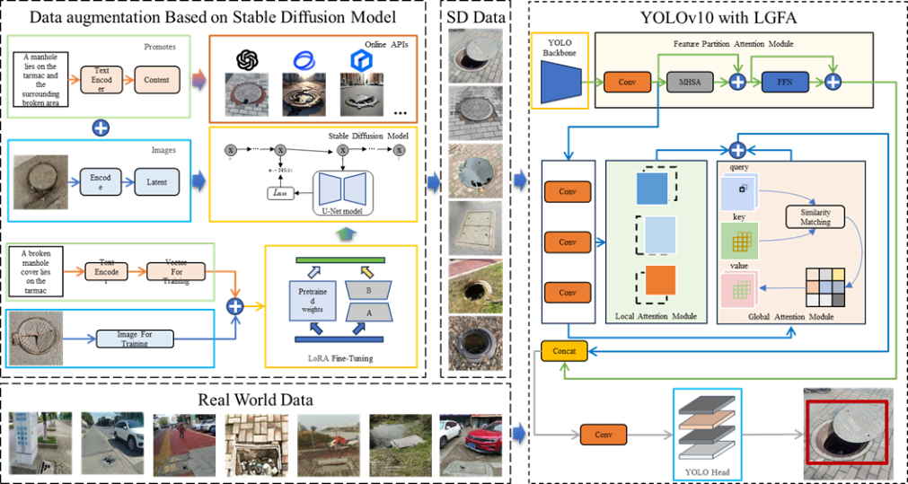

# SD-YOLO: A Lightweight Manhole Cover Defect Detection Method with Diffusion Model Data Augmentation

This is the repository for our paper:

**SD-YOLO: A Lightweight Manhole Cover Defect Detection Method with Diffusion Model Data Augmentation**

Yi Zhang, Rufei Liu, Yuzhi Wang, Yawei Li, Junfu Fan, Guoyi Li



​							**Figure 1.**Overview illustration of the proposed SD-YOLO.

​	This section describes the proposed SD-YOLO method: it consists of two parts: the Stable Diffusion strategy and the Local-Global Fusion Attention (LGFA) module.


## News

- Paper is under review, code will be released soon.


## Core Dependencies & Open-Source Credits

The implementation of this project relies on the following excellent open-source projects and pre-trained models. We sincerely thank the original authors for their contributions:

| Component Purpose           | Open-Source Project/Model Name | Official Link                                                |
| --------------------------- | ------------------------------ | :----------------------------------------------------------- |
| LoRA Model Training Toolkit | lora-scripts                   | https://github.com/Akegarasu/lora-scripts                    |
| Base Generation Model       | Stable Diffusion v1.5          | https://huggingface.co/stable-diffusion-v1-5/stable-diffusion-v1-5 (Used Model: `v1-5-pruned-emaonly.safetensors`) |
| Visual Generation Tool      | Stable Diffusion WebUI         | https://github.com/AUTOMATIC1111/stable-diffusion-webui      |


## Key Features

1. **Lightweight Training**: Leverages LoRA technology to train only low-rank matrix parameters, eliminating the need to fine-tune the entire Stable Diffusion model. Saves VRAM (supports devices with 12GB VRAM) and training time;

2. **High Compatibility**: Built on the mainstream `v1-5-pruned-emaonly.safetensors` base model and relies on the mature AUTOMATIC1111 WebUI for generation, featuring a well-developed ecosystem and ease of use;

3. **Flexible Generation**: Supports adjusting parameters such as Prompts, Negative Prompts, samplers, and resolution via WebUI. Combines trained LoRA models to generate customized images.

   

## Environment Setup

### Hardware Requirements

- Training: GPU with ≥ 12GB VRAM recommended (e.g., RTX 3090/4090, A10);
- Generation: GPU with ≥ 6GB VRAM recommended (e.g., RTX 3060/4060); no strict requirements for CPU/memory.

### Software Dependencies

1. Python 3.10+ (virtual environment via Anaconda is recommended);
2. PyTorch 2.0+ (CUDA-supported; install the corresponding version based on your GPU);
3. Other Dependencies: Refer to the official documentation of the aforementioned open-source projects to install required dependencies (e.g., `requirements.txt` for `lora-scripts` and `Stable Diffusion WebUI`).


## Quick Start

### Step 1: Download Core Components

1. **Download Base Model**: Download `v1-5-pruned-emaonly.safetensors` from the [Stable Diffusion v1.5 official repository](https://huggingface.co/stable-diffusion-v1-5/stable-diffusion-v1-5) and place it in the `models/Stable-diffusion/` directory of `Stable Diffusion WebUI`;

2. **Download LoRA Training Toolkit**: Clone the `lora-scripts` repository:

   ```bash
   git clone https://github.com/Akegarasu/lora-scripts.git
   cd lora-scripts
   # Install dependencies as per the repository documentation (e.g., run install.sh or manually install requirements.txt)
   ```

3. **Download Generation Tool**: Clone the `Stable Diffusion WebUI` repository:

   ```bash
   git clone https://github.com/AUTOMATIC1111/stable-diffusion-webui.git
   # Configure the environment as per the repository documentation (e.g., run webui.sh or webui-user.bat to install dependencies automatically)
   ```

   

### Step 2: LoRA Model Training (Based on lora-scripts)

Complete training by following the [lora-scripts official tutorial](https://github.com/Akegarasu/lora-scripts/blob/main/README.md). Core workflow:

1. Prepare training data (e.g., images of specific styles/characters; 20-100 images recommended, with uniform resolution of 512x512 or 768x768);

2. Configure training parameters (modify `config.toml` in `lora-scripts` to specify base model path, training data path, LoRA output path, training epochs, etc.);

3. Start training:

   ```bash
   # For Linux/macOS
   bash train.sh
   ```

4. After training completes, the LoRA model file (typically in `.safetensors` format) will be generated in the specified directory.

### Step 3: Image Generation (Based on Stable Diffusion WebUI)

1. Launch WebUI:

   ```bash
   # For Linux/macOS
   cd stable-diffusion-webui
   bash webui.sh
   ```

2. Load Models:

   - Select the placed `v1-5-pruned-emaonly.safetensors` from the "Stable Diffusion Model" dropdown menu on the WebUI homepage;
   - Copy the trained LoRA model file to the `models/Lora/` directory, then call it in the WebUI "Prompt" box using `<lora:model_name:weight>` (e.g., `<lora:my-style:0.8>`);

3. Configure Generation Parameters:

   - Enter Prompt (e.g., `a beautiful landscape in my-style, 8k, ultra-detailed`) and Negative Prompt (e.g., `low quality, blurry, ugly`);
   - Adjust sampler (e.g., DPM++ 2M Karras), sampling steps (20-50 steps recommended), image resolution (e.g., 512x512, 768x768), etc.;

4. Click the "Generate" button to start image generation. Results will be displayed in the preview panel on the right and can be downloaded directly.

## Benchmarking


​							**Table 1.** Evaluation Results for Each Manhole Cover Defect Category


​							**Table 2.** Ablation Study Results: To enhance the reliability and statistical significance of the 							experimental outcomes, five independent experiments were conducted when applying different 							modules to the original dataset. The results are presented as averages.


​							**Figure x.** Visualization plots of the features of the MCDD and MCDD with SDDA datasets. (a) and 							(b) presents the class-wise sample distribution of the dataset, with the X-axis representing 							different categories, and the Y-axis indicating the number of samples in each category, (c) and (d) 							visualize the distribution of manhole cover center positions, where the X-axis and Y-axis represent 							the normalized X-coordinate and normalized Y-coordinate of the sample center, (e) and (f) show 							the height-width distribution of the sample images, where the X-axis and Y-axis respectively 							represent the ratio of the target box height to the image height and the ratio of the target box 							width to the image width.

## Notes

1. Training data quality directly affects LoRA model performance. Use clear, clutter-free images with consistent styles/subjects and perform appropriate cropping;
2. Adjust the LoRA model weight (typically between 0.5-1.0) to optimize generation results based on actual needs;
3. If encountering VRAM shortages, add `--xformers` or `--medvram` parameters when launching WebUI to optimize VRAM usage;
4. Comply with open-source licenses and relevant laws/regulations. Do not use this project to generate infringing, illegal, or inappropriate content.

## Acknowledgements

- Thanks to [Akegarasu](https://github.com/Akegarasu) for providing `lora-scripts`, which simplifies the LoRA training process;
- Thanks to the [Stable Diffusion v1.5 team](https://huggingface.co/stable-diffusion-v1-5) for the high-quality pre-trained base model;
- Thanks to [AUTOMATIC1111](https://github.com/AUTOMATIC1111) for developing `stable-diffusion-webui`, which offers a convenient visual generation tool.

## License

This project is only an integration and application of open-source components. It adheres to the original licenses of the dependent open-source projects (please refer to the LICENSE files of the aforementioned projects).


